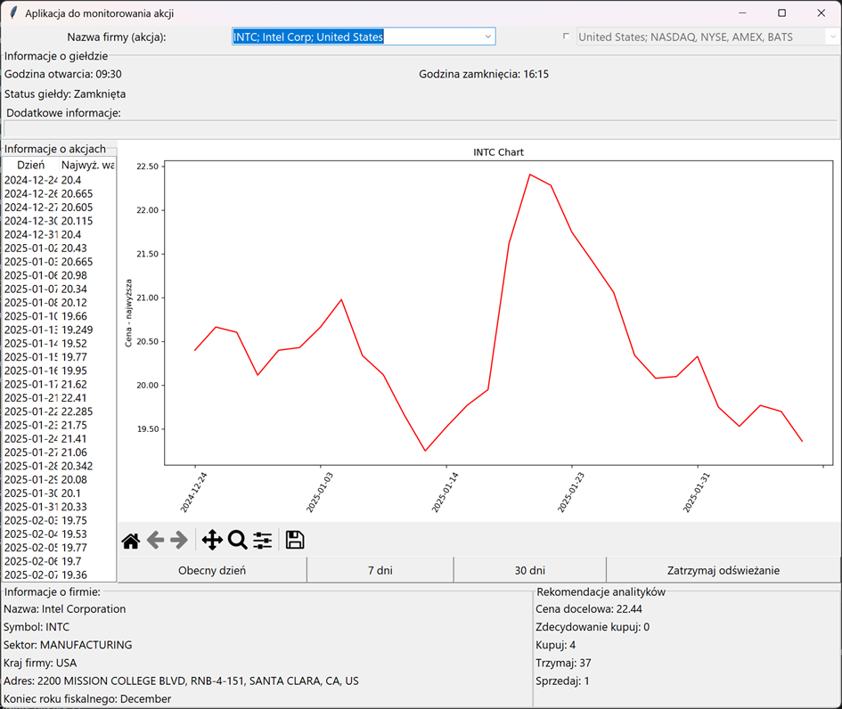

# Stock Market App

## Description
Application was made for the project for my university classes. 

The application allows users to monitor company stocks across various stock markets. The user can select a country from which they want to track stocks and then search for a specific company of interest. The application retrieves data from an external API, displays stock price trend charts, and provides analysts' recommendations on whether to buy, sell, or hold stocks. Due to limited access to API data (all features are unlocked for premium users), the functionality for retrieving stocks from markets other than the U.S. stock exchange is disabled. Nevertheless, the written code supports receiving information from other stock exchanges.

## Features
The application's features include:
- Dynamic stock search and selection.
- Displaying market and company information.
- Presenting stock price trend charts over various time periods.
- Automatic data refresh.
- Handling analysts' recommendations.

## Requirements

Python version:
- Python 3.x

Libraries:
- tkinter – for building the graphical user interface.
- matplotlib – for generating charts.
- ctypes, platform, subprocess, re – for operating system handling and data processing.
- json – for modifying JSON files.
- pandas – for loading data files.
- requests – for sending requests to the API server.

## Startup Guide
1. Install Required Libraries
Ensure you have all the necessary libraries installed. You can install them using:

`pip install matplotlib pandas requests`

Note: tkinter is included by default in most Python distributions.

2. Prepare Your API Key
Before running the application, obtain your own API key from the Alpha Vantage website.

3. Run the Application
Execute the program from the projektNew.py file:
`python projektNew.py`

4. Enter API Key
After launching, a dialog window will appear asking for your API key. Enter your key to proceed.
Selecting "Cancel" will terminate the program.
